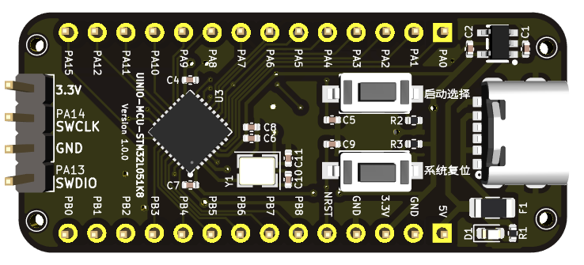
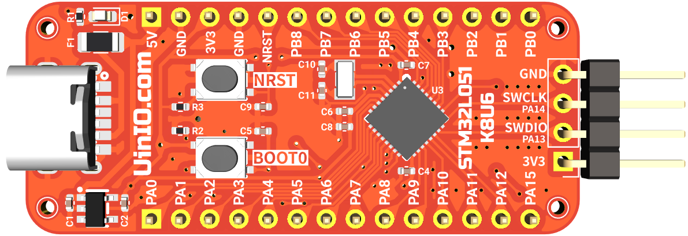

# UINIO-MCU-STM32L051K8 开发板

一款基于 [**意法半导体 STM32L051K8**](https://www.st.com/en/microcontrollers-microprocessors/stm32l051k8.html) 微控制器的开发板设计。

- 预留有外部贴片晶振（4 引脚）的位置；
- 采用 **USB Type-C** 接口；
- 添加了 `Imax` 为 `750mA` 的自恢复保险丝，防止后级操作短路损毁芯片；
- **28** 个 **GPIO** 引脚资源悉数全部引出；
- 自带 **SOIC** 封装的 **W25Q** Flash 存储器芯片，可以按需进行贴装；
